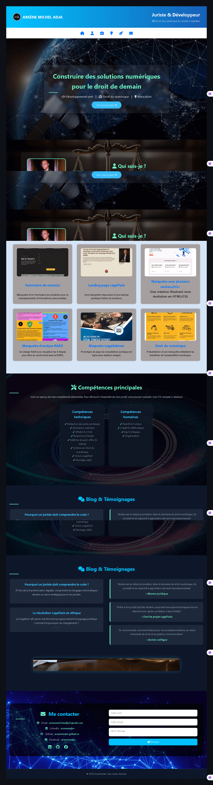

# 🎮 Mini Projet Madara

Ce projet est une maquette interactive conçue avec **HTML**, **CSS** et un peu de **JavaScript**.
Il s’agit d’un projet personnel de formation pour mettre en pratique mes compétences en **intégration web**.

## 🖼️ Aperçu

> Maquette visuelle avec animation, responsive design, effets sur images et sections interactives.



---

## 🚀 Démo en ligne

👉 [Voir la démo sur GitHub Pages](https://arsenemdev.github.io/mini-projet-madara)

---

## 🧱 Fonctionnalités

- Structure HTML sémantique (header, sections, footer)
- Mise en page responsive (flexbox)
- Transitions CSS et effets visuels
- Intégration d’une vidéo en fond
- Menu de navigation stylisé
- Animation simple avec JavaScript

---

## 🛠️ Technologies utilisées

- HTML5
- CSS3 (avec animations, transitions)
- JavaScript de base (DOM)
- GitHub Pages pour l'hébergement

---

## 📁 Arborescence du projet

Le projet est organisé comme suit :

```
mini-projet-madara/
│
├── index.html
├── css/
├── images/
├── video/
├── .gitattributes
└── README.md
```

---

## 📫 Contact

Merci d’avoir visité ce projet ! 🙏
📩 Contact : [arsenemicheladja@gmail.com](mailto:arsenemicheladja@gmail.com)
